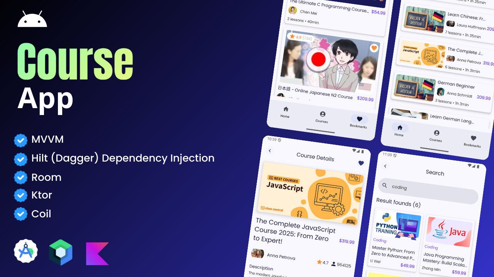

## ✨ Course App - Clean Architeture using MVVM

  

## 🧑‍💻 Architeture
This project follows the **MVVM** pattern to separate concerns and promote modularity. Key practices include:
- Database: **Room** handles saving bookmarked courses using SQL locally on the device.
- State Management: ViewModels manage UI states efficiently, ensuring responsive and clean UI updates.
- Separation of Concerns: Clear distinction between UI logic, business logic, and data layers.
- Dependency Injection: **Hilt/Dagger** handles dependencies across the app, making it easier to test and manage.

## 🔥 Features
- Efficient Image Loading: Uses **Coil** for smooth and optimized image loading.
- API Communication: Uses **Ktor** for network requests and responses.
- Navigation: Implements the Jetpack Navigation component for smooth transitions between screens.
